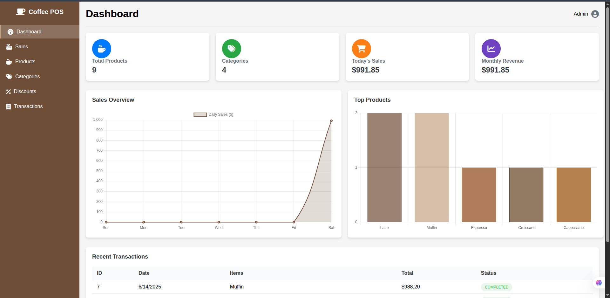

# Coffee POS System

Welcome to the Coffee POS system, a lightweight and efficient point-of-sale solution tailored for coffee shops. This system is built using HTML, CSS, JavaScript, localStorage, Font Awesome icons, and Chart.js. It offers a suite of features designed to streamline your shop's operations:

## Features

- **Dashboard Page**: Provides an overview of your shop's performance with informative cards displaying the total number of products, categories, and more. It also includes charts to track sales trends and highlight top-selling products.

- **Products Management**: Easily manage your product inventory with options to add, edit, or delete products. 

- **Categories Management**: Organize your products into categories for better control and visibility.

- **Discounts**: Apply discounts to products based on category, helping you manage promotions effectively.

- **Sales Page**: Facilitate the selling of products with a built-in shopping cart for calculating total sales.

This POS system is designed to enhance the efficiency of your coffee shop, providing a seamless experience for both staff and customers.

